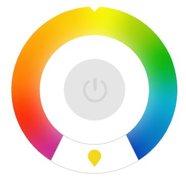

# xyz-angular-knob-rgb-light (PoC)
An angularjs knob component to control RGB Lights.

The component is just a **proof of concept** and need a lot of fixes and improvements in order to be used in production.

It requires the premium version of [GSAP](https://greensock.com/gsap)
 

## [Live demo](http://lab.unshift.xyz/components/angularjs-knob-light/2_demo.html) | [Watch the video](https://www.youtube.com/watch?v=w8yx4zIsRWk)

# Usage:

  
    
    <xyz-knob-rgb-light options="ctrl.knobOptions" 
    					on-off-change="ctrl.onToggleLight($status)"
    					on-change="ctrl.onDragEnd($rotation)"
    					class="knob"></xyz-knob-rgb-light>

## Controller:

    var app = angular.module("KnobDemo", ["xyz"])
    
    .controller('Demo1Ctrl', function(){
      
      this.knobOptions = {
    	throwProps: true,
    	snap: 45
      }
    
      this.onToggleLight = function(value) {
      	this.onOffStatus = value;
      }
      
      this.onDragEnd = function(value) {
    	  this.currentRotation = value;
    	  this.perc = parseInt((value*100)/360);
      }
    
    })

----------

 
#### Todos
- Scaffolding / minification / Gulp
- Responsive Layout
- Handle initial configuration
- Register to Bower 
- Unit Test

#### Main issues

- layout e css improvements
- fix rotation value, sometimes is negative 
- remove $timeout in xyzKnobRgbLight directive
- directives refactoring 
